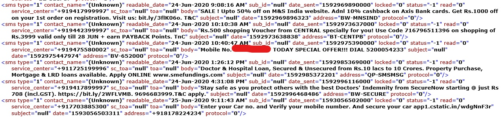
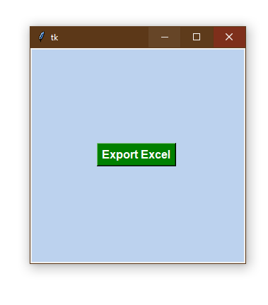

# SMS-extraction
Have you ever thought of arranging all the sms on your phone in an excell sheet ! Well, during lockdown this thought crossed my mind while I was changing to a new android phone!

To begin wtih you need to store all the sms on your phone in an xml file. Don't worry!, there are apps on playstore to do that job for you...
I used the app - SMS Backup & Restore, to get myself the xml file I need to begin with.

------------sample xml file snippet --------------

------------ Simple import hit button ----------------

